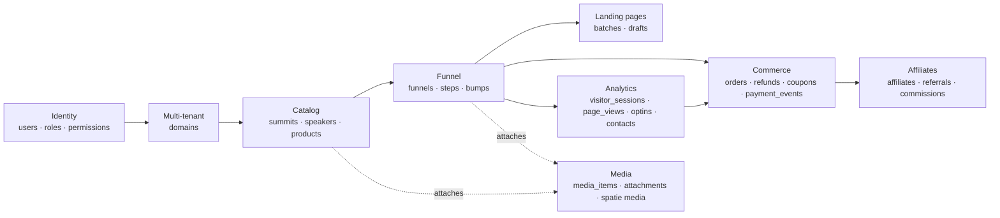
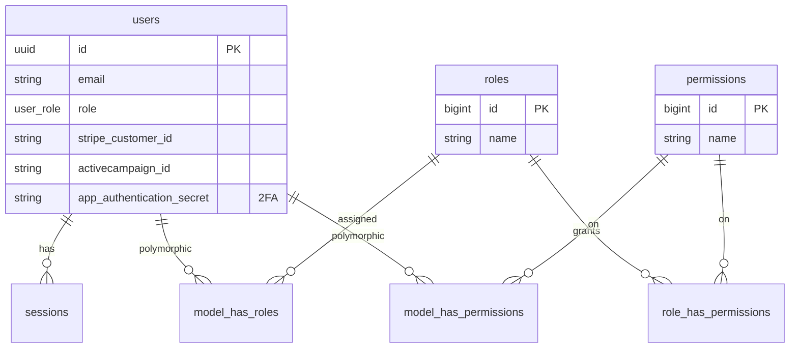
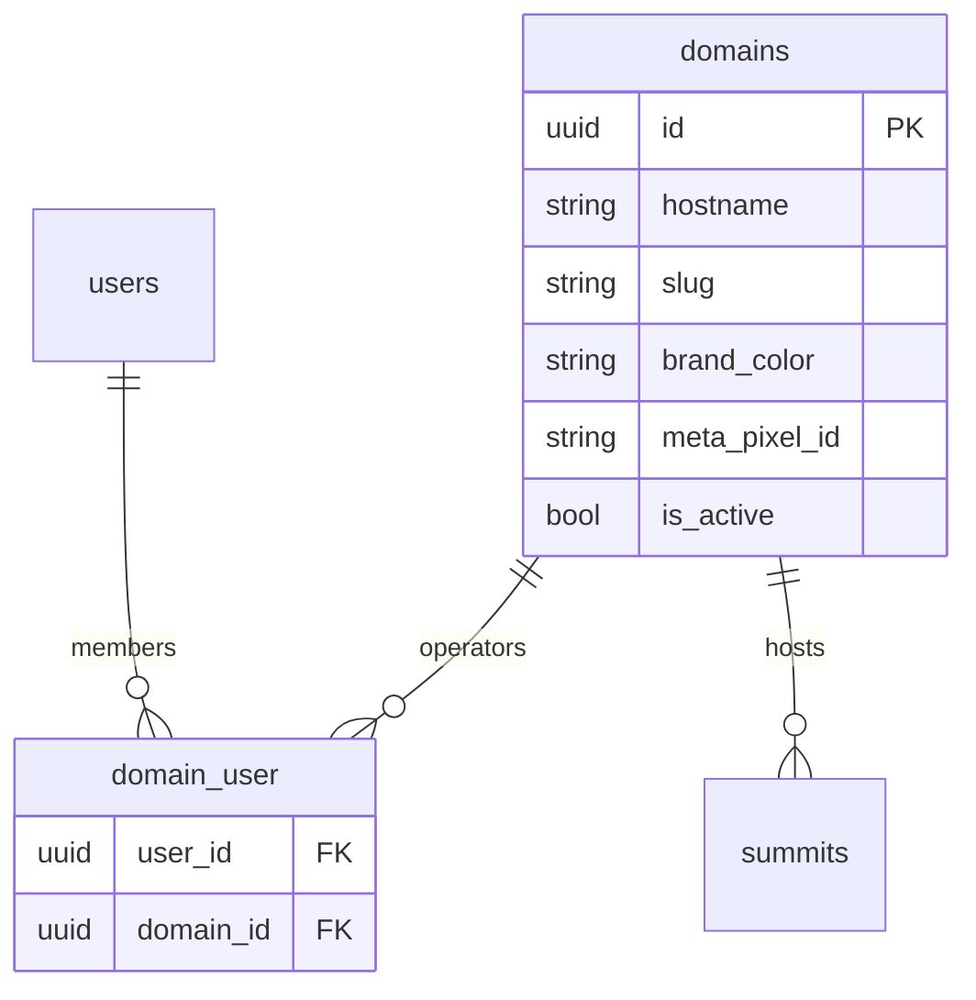
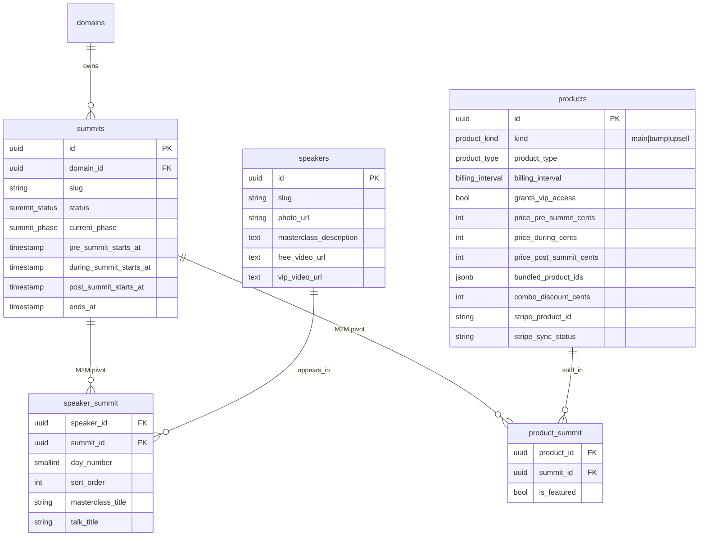
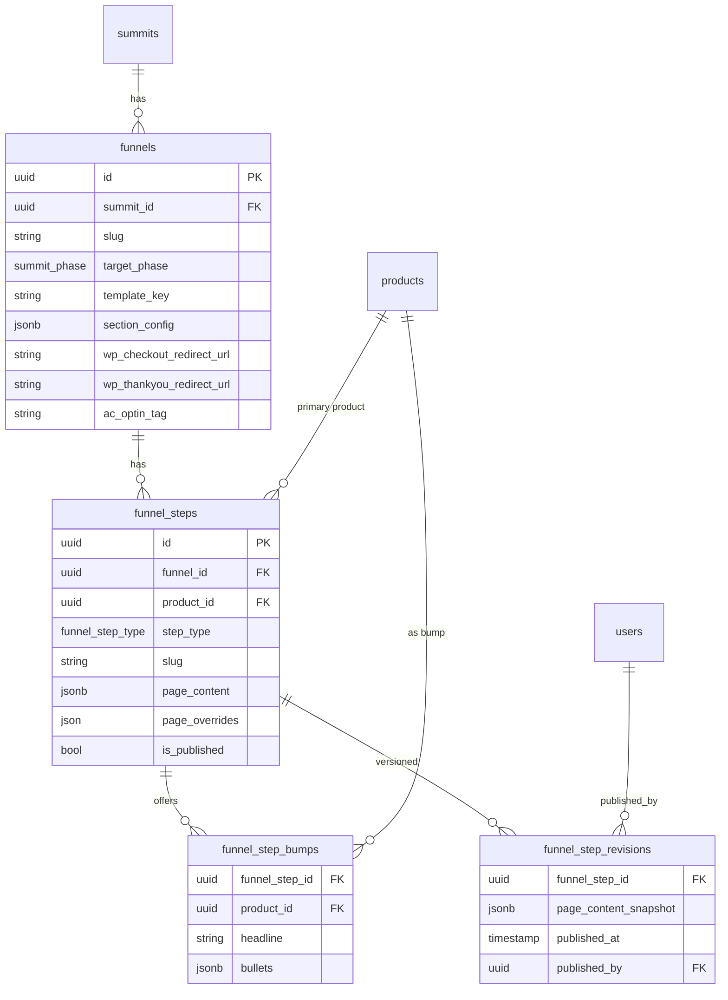
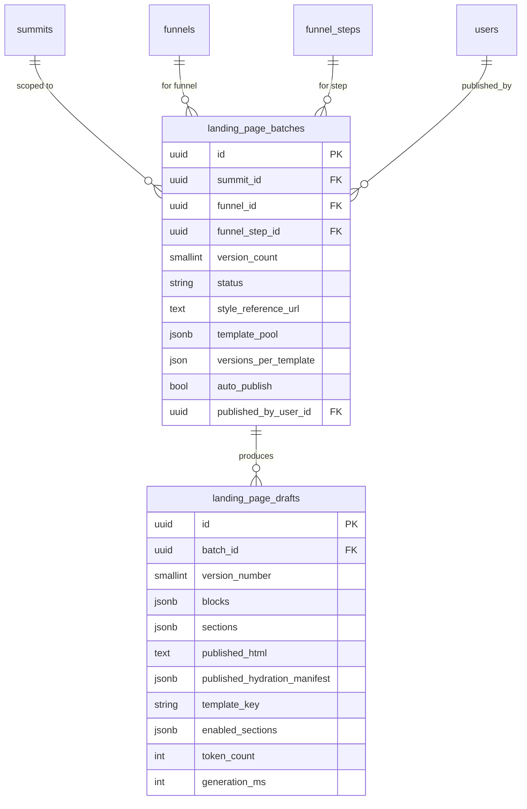
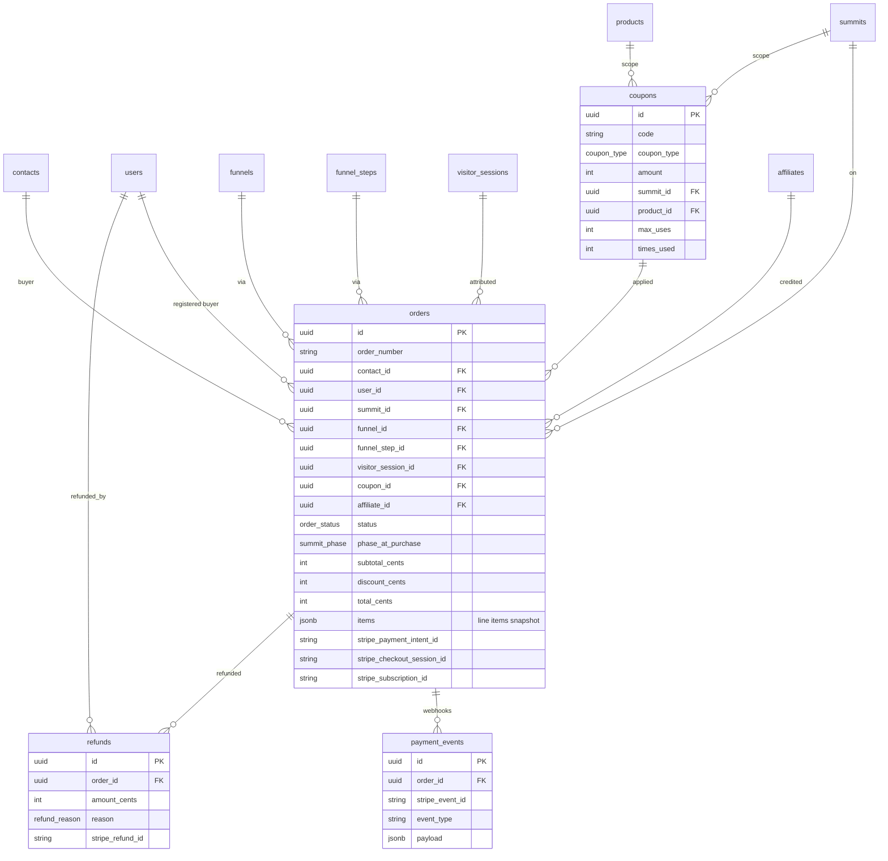
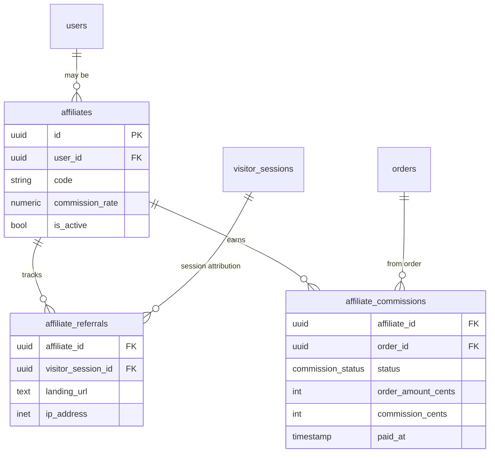
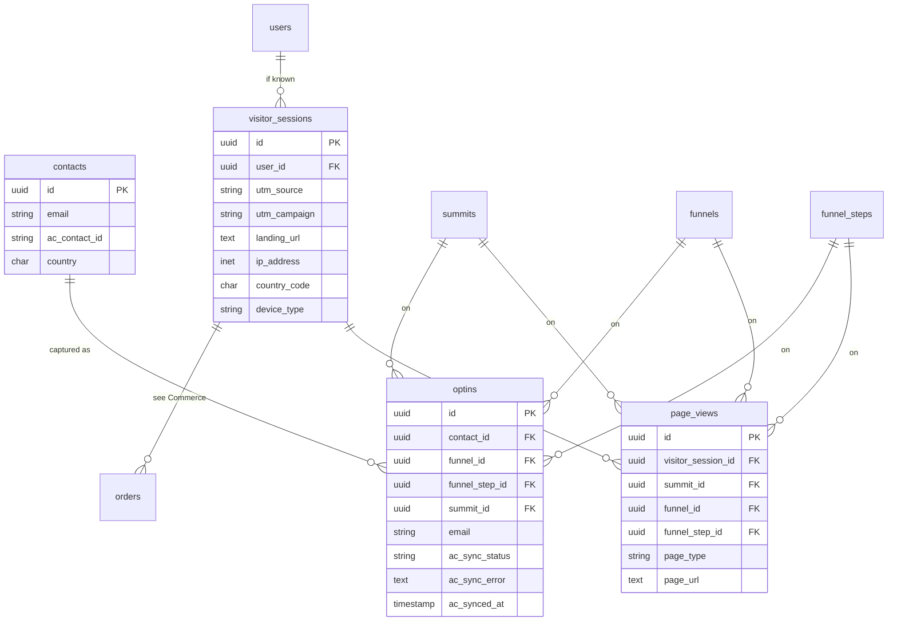
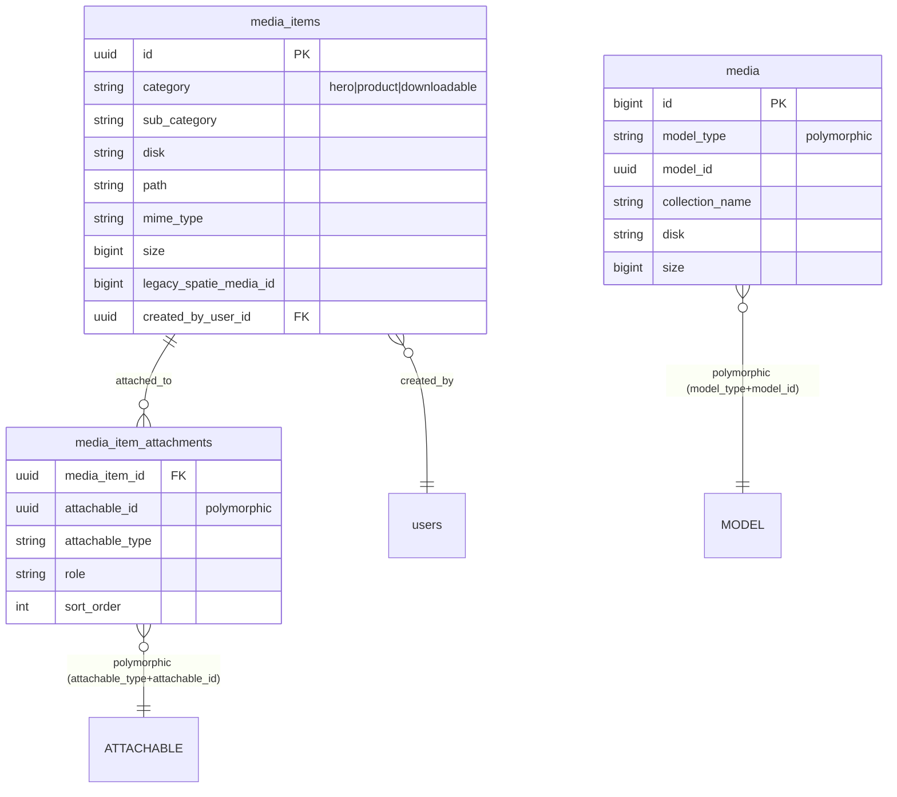

# Database Schema Index

Visual map of every table and how they connect. Grouped by bounded context.
All IDs are `uuid` unless noted. Diagrams use Mermaid ER syntax — arrows point
**from child → parent** (the side that holds the FK points at the side it references).

---

## 1. Big picture

How the contexts fan out from `domains → summits → funnels`:

---

## 2. Identity & access

Spatie polymorphic pivots key off `model_type` + `model_id` (uuid).

---

## 3. Multi-tenant: domains

A summit belongs to **exactly one** domain (`summits.domain_id`).

---

## 4. Catalog: summits, speakers, products

Speakers and products are now **global**; their attachment to a summit lives
in the pivot tables.

---

## 5. Funnels: funnels → steps → bumps → revisions

---

## 6. Landing page generator: batches → drafts

---

## 7. Commerce: orders, payments, refunds, coupons

Order line items are denormalized into `orders.items` (jsonb) at purchase time.

---

## 8. Affiliates

---

## 9. Analytics: sessions, pageviews, optins, contacts

`contacts` is the single source of truth for an email; `optins` and `orders`
both point at it.

---

## 10. Media library

Two parallel systems. Spatie `media` handles raw file storage; `media_items`
is the in-house typed library, attached polymorphically to any model.

---

## 11. Settings & infrastructure

Single-row config + framework tables — no FKs.

| Table | Purpose |
|---|---|
| `app_settings` | Singleton: company name, default currency, brand color, AC list id |
| `cache`, `cache_locks` | Laravel cache driver |
| `jobs`, `failed_jobs`, `job_batches` | Queue worker tables |
| `sessions` | Laravel session driver (`user_id` → users) |
| `password_reset_tokens` | Auth |
| `migrations` | Schema version log |

---

## 12. Foreign-key cheat sheet

Every cross-context FK in one place. Use this to trace data flow.

| From | Column | → To |
|---|---|---|
| `summits` | `domain_id` | `domains` |
| `funnels` | `summit_id` | `summits` |
| `funnel_steps` | `funnel_id` | `funnels` |
| `funnel_steps` | `product_id` | `products` |
| `funnel_step_bumps` | `funnel_step_id` | `funnel_steps` |
| `funnel_step_bumps` | `product_id` | `products` |
| `funnel_step_revisions` | `funnel_step_id` | `funnel_steps` |
| `funnel_step_revisions` | `published_by` | `users` |
| `speaker_summit` | `speaker_id`, `summit_id` | `speakers`, `summits` |
| `product_summit` | `product_id`, `summit_id` | `products`, `summits` |
| `domain_user` | `domain_id`, `user_id` | `domains`, `users` |
| `landing_page_batches` | `summit_id` / `funnel_id` / `funnel_step_id` / `published_by_user_id` | `summits` / `funnels` / `funnel_steps` / `users` |
| `landing_page_drafts` | `batch_id` | `landing_page_batches` |
| `orders` | `contact_id` | `contacts` |
| `orders` | `user_id` | `users` |
| `orders` | `summit_id` / `funnel_id` / `funnel_step_id` | catalog/funnel |
| `orders` | `visitor_session_id` | `visitor_sessions` |
| `orders` | `coupon_id` | `coupons` |
| `orders` | `affiliate_id` | `affiliates` |
| `payment_events` | `order_id` | `orders` |
| `refunds` | `order_id`, `refunded_by` | `orders`, `users` |
| `coupons` | `summit_id`, `product_id` | `summits`, `products` |
| `affiliates` | `user_id` | `users` |
| `affiliate_referrals` | `affiliate_id`, `visitor_session_id` | `affiliates`, `visitor_sessions` |
| `affiliate_commissions` | `affiliate_id`, `order_id` | `affiliates`, `orders` |
| `optins` | `contact_id` / `funnel_id` / `funnel_step_id` / `summit_id` / `user_id` | … |
| `page_views` | `visitor_session_id` / `user_id` / `summit_id` / `funnel_id` / `funnel_step_id` | … |
| `visitor_sessions` | `user_id` | `users` |
| `media_items` | `created_by_user_id` | `users` |
| `media_item_attachments` | `media_item_id` | `media_items` |
| `media`, `media_item_attachments` | `model_*` / `attachable_*` | **polymorphic** |

---

## 13. Enums

Postgres enum types live in migration `2026_04_17_100000_create_v2_enums.php`
and friends:

- `summit_status`, `summit_phase`
- `funnel_step_type`
- `product_type`, `product_kind`, `billing_interval`
- `order_status`, `coupon_type`, `commission_status`, `refund_reason`
- `user_role`
